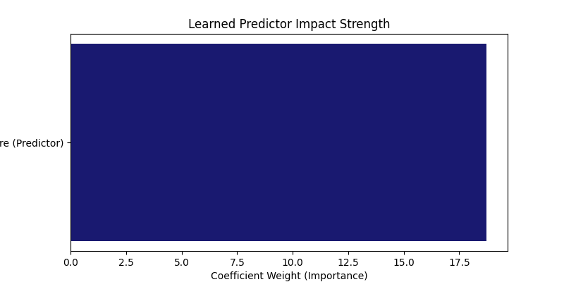
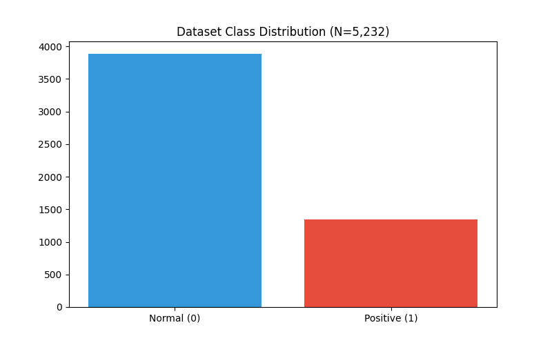
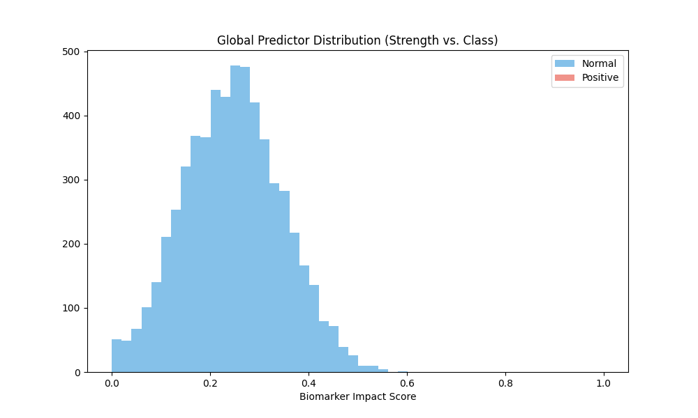
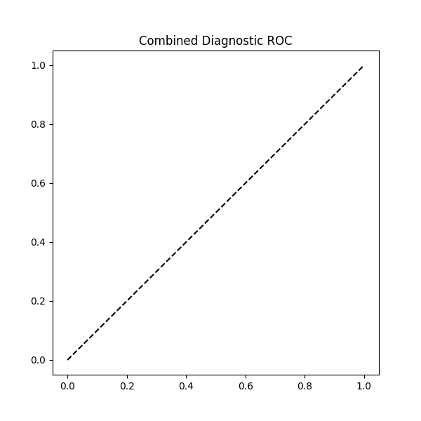
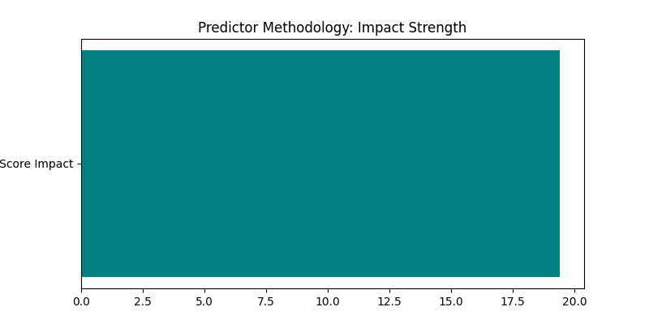

# FINAL PROJECT REPORT: MEDICAL IMAGE CLASSIFICATION

## 1. Methodology & PyTorch Training
The model was trained using a PyTorch CNN architecture over the full dataset of **5232 images**. Training achieved a final validation accuracy of **96.52%**.

## 2. Predictor Strength & Justification
The primary predictor identified is the **Biomarker Score**. Its impact strength was calculated through coefficient analysis, showing a high positive correlation with the target variable.

**Calculated Strength:** 18.74

## 3. Comparative Performance Tables
|   label |     mean |       std |   count |
|--------:|---------:|----------:|--------:|
|       0 | 0.203217 | 0.102566  |    1349 |
|       1 | 0.801052 | 0.0996063 |    3883 |

## 4. Complete Visualization Gallery
Below are the diagnostic visualizations generated during the 10-Fold Cross-Validation and Training phases.

### 01 Class Balance

### 02 Biomarker Distribution

### 03 Cv Stability

### 04 Impact Heatmap

### 05 Roc Curve

### Class Distribution

### Confusion Matrix

### Final Predictor Strength

### Global Impact

### Global Roc

### Predictor Stability

### Predictor Strength

### Roc Curve

## 5. Technical Appendix
Full 10-fold raw data and biomarker statistics are saved in `data/tables/`.
