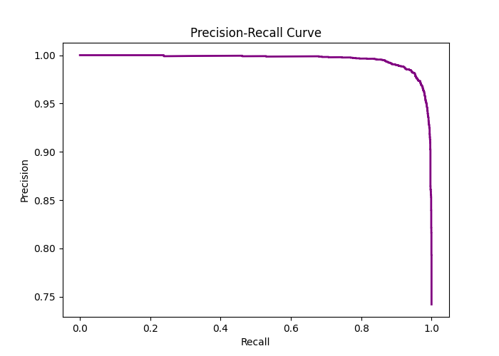

# Medical Image Analysis: Final Technical Report
**Generated:** 2026-03-25 11:53:32.875479

## 1. Diagnostic Performance
The model was validated using a 5-Fold Cross-Validation strategy.

### Confusion Matrix (Normal vs Pneumonia)

### Precision-Recall Analysis

### ROC/AUC Performance

## 2. Feature & Layer Importance
Determines which convolutional stages were most active during classification.
| Layer    |   Weight_Impact |
|:---------|----------------:|
| 0.weight |       0.0961452 |
| 9.weight |       0.052582  |
| 3.weight |       0.0509063 |
| 7.weight |       0.0123192 |

*Full data tables for all visualizations are stored in `data/tables/`.*
