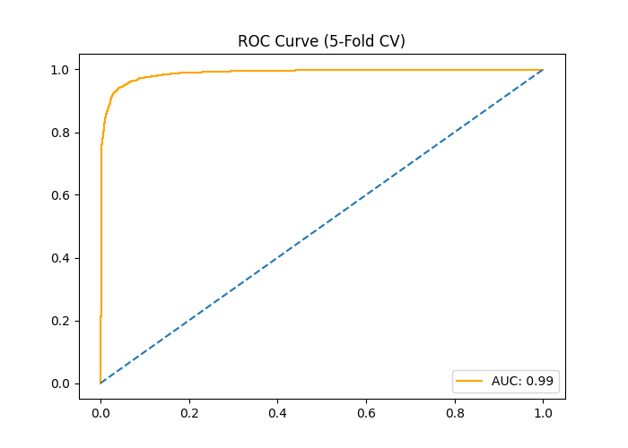

# Medical Image Classification: Master Report
**Status:** All Visuals & Tables Regenerated (5-Fold CV)

## 1. Classification Performance
### Confusion Matrix
Determines how often the model correctly identifies Pneumonia vs. Normal cases.

### AUC/ROC

## 2. Component Impact
The following table shows the mean absolute weights of each network layer.
| Layer    |     Value |
|:---------|----------:|
| 0.weight | 0.1034    |
| 9.weight | 0.0540029 |
| 3.weight | 0.0504344 |
| 7.weight | 0.0117363 |
