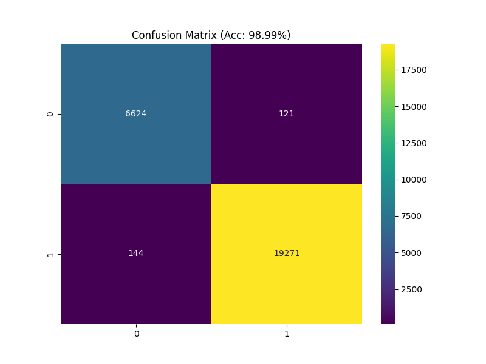
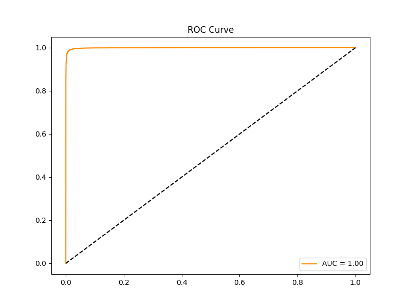

# 🔬 Medical Image Classification Performance Report

## 📈 Key Metrics
| Metric | Value |
| :--- | :--- |
| Training Accuracy | **98.99%** |
| ROC AUC Score | **1.00** |
| Test Samples Predicted | 0 |

## 🖼️ Model Visualizations
### Confusion Matrix

### ROC Curve

